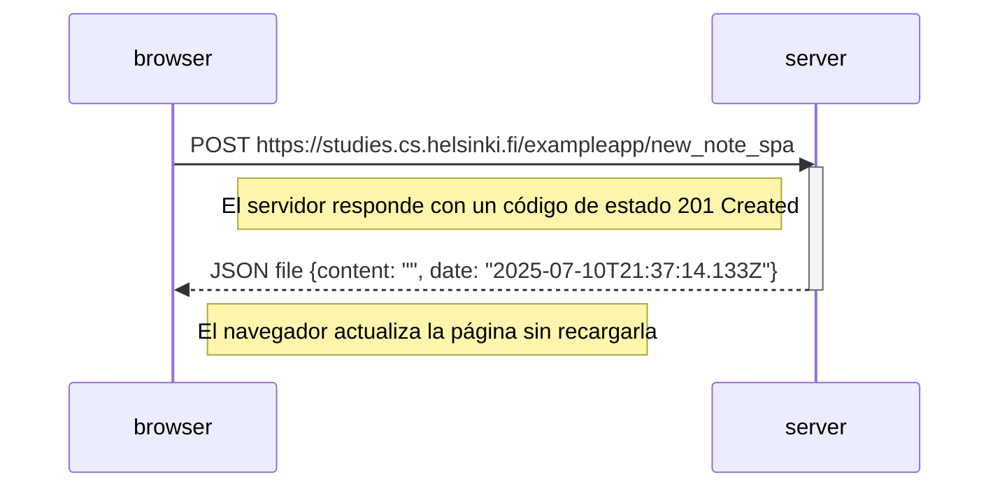

```mermaid 
 sequenceDiagram
    participant browser
    participant server

    browser->>server: POST https://studies.cs.helsinki.fi/exampleapp/new_note_spa
    activate server
    Note left of server: El servidor responde con un código de estado 201 Created
    server-->>browser: JSON file {content: "", date: "2025-07-10T21:37:14.133Z"}
    deactivate server
    Note right of browser: El navegador actualiza la página sin recargarla
```
